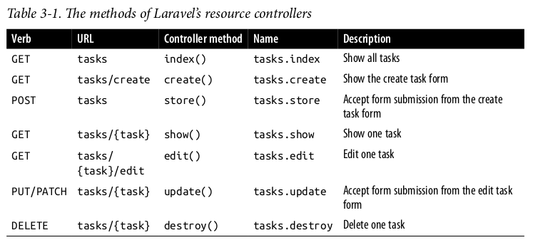

# Laravel Routing

The essential function of any web application framework is to take requests from a
user and deliver responses, usually via HTTP(S). This means defining an application’s
routes is the first and most important project to tackle when learning a web frame‐
work; without routes, you have little to no ability to interact with the end user.

**MVC**

Model: Represents an individual database table (or a record from that table)

View: Represents the template that outputs your data to the end user like Login page

Controller: Takes HTTP requests from the browser, gets the right data out of the database and other storage mechanisms, validates user input, and eventually sends a response back to the user.


**HTTP Verbs**

GET: Request a resource (or a list of resources).

HEAD: Ask for a headers-only version of the GET response.

POST: Create a resource

PUT: Overwrite a resource.

PATCH: Modify a resource.

DELETE: Delete a resource.

OPTIONS: Ask the server which verbs are allowed at this URL.





**REST**

It’s an architectural style for building APIs.

• Being structured around one primary resource at a time (e.g., tasks )

• Consisting of interactions with predictable URL structures using HTTP verbs

• Returning JSON and often being requested with JSON


> REST-based APIs follow mainly this same structure, except they don’t have a create
> route or an edit route, since APIs just represent actions, not pages that prep for the
> actions.


**Route Definition**

In a Laravel application, you will define your web routes in routes/web.php and your
API routes in routes/api.php. Web routes are those that will be visited by your end
users; API routes are those for your API, if you have one. For now, we’ll primarily
focus on the routes in routes/web.php.

```php
// routes/web.php
Route::get('/', function () {
	return 'Hello, World!';
});
```

> What’s a Closure?
> Closures are PHP’s version of anonymous functions


```php
$router->get('/', function () {
	return 'Hello, World!';
});
```

**Route verbs**

```
Route::get/post/put/delete/any/match(path, handler);
```

**Route handling**

```
// Closure
Route::verb('/path', closure);

// Controller
Route::verb('/path', [ControllerClass::class, 'action']);
Route::verb('/path', 'ControllerName@action');

Route::resource('resource', [ControllerClassName::class]);
Route::resource('resource', 'ControllerClassName');

```


**Route parameters**

```
Route::get('resource/{param}/{optionalParam?}', [Controller::class, 'action']);
```

REGEX

```
Route::get('users/{id}', function($id) {
	// 
})

->where('id', '[0-9]+');
->where('username', '[A-Za-z]+');
->where(['id' => '[0-9]+', 'slug' => '[A-Za-z]+']);
```

Parameters of route declaration follows right order as declared. Unless you use route model binding. 

**Route names**

```
url()
Route::get(...)->name('route.name');
{{ route('route.name', ['data1' => 1, 'data2' => 2])}}


```

**Custom Route**

```php
Route::get('members/{id}', [
    'as' => 'members.show',
    'uses' => 'MembersController@show',
]);
```

**Route Naming Conventions**

```
photos.index
photos.create
photos.store
photos.show
photos.edit
photos.update
photos.destroy
```

**Passing Route Parameters to the route() Helper**

```
{{ route('route.name', ['data'=> 'value'])}}

route('users.comments.show', [1, 2])
// http://myapp.com/users/1/comments/2

route('users.comments.show', ['userId' => 1, 'commentId' => 2])
// http://myapp.com/users/1/comments/2

route('users.comments.show', ['commentId' => 2, 'userId' => 1])
// http://myapp.com/users/1/comments/2

route('users.comments.show', ['userId' => 1, 'commentId' => 2, 'opt' => 'a'])
// http://myapp.com/users/1/comments/2?opt=a
```

------


**Route Group**

```php
Route::group(function () {
    Route::get('hello', function () {
        return 'Hello';
    });
    Route::get('world', function () {
        return 'World';
    });
});
```

Middleware in route group

```php
Route::group(['middleware' => 'auth'], function () { OR,
Route::middleware('auth')->group(function() {
    
    Route::get('dashboard', function () {
    	return view('dashboard');
    });
    Route::get('account', function () {
    	return view('account');
    });
    
});
```

Applying middleware in controller level

```php
class DashboardController extends Controller
{
    public function __construct()
    {
        $this->middleware('auth');
        $this->middleware('admin-auth')
        ->only('editUsers');
        $this->middleware('team-member')
        ->except('editUsers');
    }
}
```

Rate limiting middleware `throttle`

```
Route::middleware('auth:api', 'throttle:60,1')->group(function () {
    Route::get('/profile', function () {
    //
    });
});
```

**Path prefixes**

```
Rotue::prefix('dashboard')->group(closure);
```

**Fall-back Route**

```
Route::any('{anything}', handle)->where('anything', '*');
Route::fallback(closure);
```

**Sub-domain routing**

```
Route::domain('api.myapp.com')->group(handler);
// Parameterized sub-domain routing
Route::domain('{account}.myapp.com')->group(handler);

// Example
Route::domain('{account}.myapp.com')->group(function () {
    Route::get('/', function ($account) {
    	//
    });
    Route::get('users/{id}', function ($account, $id) {
    	//
    });
});

```

**Name-space prefixes**

```php
Route::namespace('Dashboard')->group(function () {
    // App\Http\Controllers\Dashboard\PurchasesController
    Route::get('dashboard/purchases', 'PurchasesController@index');
});
```

**Name prefix**

```
Route::name('users.')->prefix('users')->group(function () {
    Route::name('comments.')->prefix('comments')->group(function () {
    Route::get('{id}', function () {
    })->name('show');
    });
});
```


**Signed Routes**

// TODO

Signing a route

```
Route::get('invitations/{invitation}/{answer}','InvitationController')->name('invitations');
```

```
// Generate a normal link
URL::route('invitations', ['invitation' => 12345, 'answer' => 'yes']);
// Generate a signed link
URL::signedRoute('invitations', ['invitation' => 12345, 'answer' => 'yes']);
// Generate an expiring (temporary) signed link
URL::temporarySignedRoute(
'invitations',
now()->addHours(4),
['invitation' => 12345, 'answer' => 'yes']
);
```

> now() is equivalent to Carbon::now()

Modifying Routes to Allow Signed Links

```
// $routeMiddleware array in app/Http/Kernel.php,
// Backed by Illuminate\Routing\Middleware\ValidateSignature

Route::get('invitations/{invitation}/{answer}','InvitationController')
->name('invitations')
->middleware('signed');
```

Or from Request object

```php
class InvitationController
{
public function __invoke(Invitation $invitation, $answer, Request $request)
    {
        if (! $request->hasValidSignature()) {
        abort(403);
    }
    //
    }
}
```


**Views**

```
Route::view('/','welcome');
Route::view('/', 'welcome', ['User' => 'Michael']);

// returning view
Route::get('/', function () {
	return view('home');
});

// Passing data to view
Route::get('tasks', function () {
    return view('tasks.index')
    			->with('tasks', Task::all());
});

```

Using View Composers to Share Variables with Every View

```
view()->share('variableName', 'variableValue');
```


